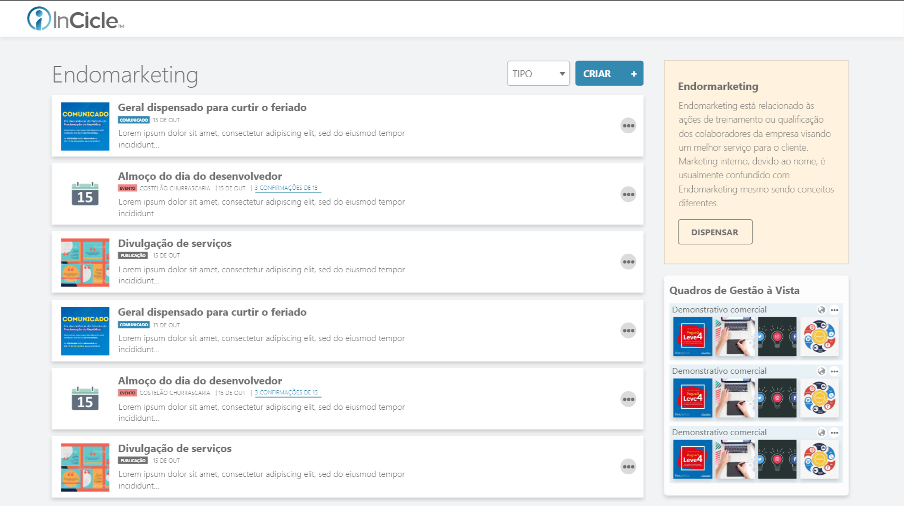

<h1 align="center">Desafio-Teste - React, HTML5, CSS3 e JavaScrip</h1>

<strong>(Vaga Dev. Front-End Júnior)</strong>

Desafio-Teste proposto pela 
 Esse teste consiste em conhecermos um pouco o seu conhecimento na área de desenvolvimento de interfaces para internet. Sendo assim, avaliaremos o seu domínio das linguagens HTML5, CSS3 e JavaScript, assim como também a utilização do framework React.como parte do processo seletivo para a vaga de Desenvolvedor Front-End Júnior

<h4 align="center"> 
<h2 align="center">	👨🏽‍🔧🚧 Projeto em Construção 🚧 👨🏽‍🔧 </h2>

<h2>- O Desafio</h2>
 

Esse teste consiste em conhecermos um pouco o seu conhecimento na área de desenvolvimento de interfaces para internet. Sendo assim, avaliaremos o seu domínio das linguagens HTML5, CSS3 e JavaScript, assim como também a utilização do framework React.como parte do processo seletivo para a vaga de Desenvolvedor Front-End Júnior.
 
1. Crie uma aplicação no seu ambiente local;

2. Com uma estrutura de componentes ao seu critério, desenvolva a página conforme o arquivo **endomarketing.xd**;
   

- Utilize a font Open Sans;
- Elabore a versão responsiva da tela;
- Recomendamos a utilização do Material UI v5;

3. Utilize o arquivo data.json para realizar a integração dos dados;

- Apresente os dados na tela conforme o json informado;
- Sob nenhuma circunstância altere o arquivo <a href="https://github.com/dayvisondunga/teste-incicle/blob/master/src/api/data.json" target="_blank">data.json</a>.

 

<h2>- Visualizando o projeto 😎</h2> 
 

O projeto pode ser visualizado <a href="https://github.com/dayvisondunga/teste-incicle/blob/master/src/api/data.json" target="_blank">clicando aqui</a>.

